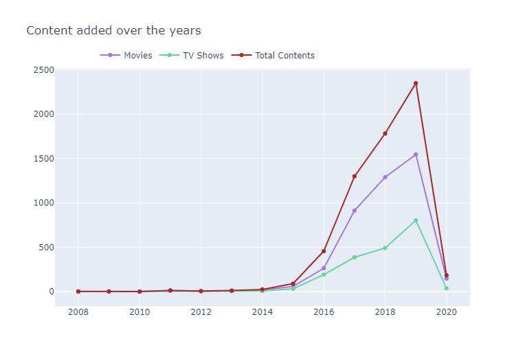
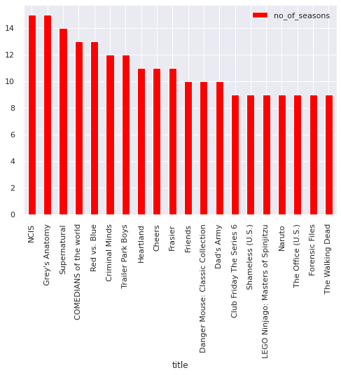

# Netflix-Recommendation-System
## To obtain insights about Netflix movies and series in Germany and build a content-based recommendation system

**Author** : SHAILESH DHAMA

## Objectives :
            
            Understanding what content is available in different countries
            Identifying similar content by matching text-based features
            Network analysis of Actors / Directors and find interesting insights
            Content-Based Recommendation for Netflix Platform.

### Dataset:

This dataset consists of tv shows and movies available on Netflix as of 2019. The dataset is collected from Flixable which is a third-party Netflix search engine.

In 2018, they released an interesting report which shows that the number of TV shows on Netflix has nearly tripled since 2010. The streaming service’s number of movies has decreased by more than 2,000 titles since 2010, while its number of TV shows has nearly tripled. It will be interesting to explore what all other insights can be obtained from the same dataset.

Integrating this dataset with other external datasets such as IMDB ratings, rotten tomatoes can also provide many interesting findings.
    
## Approach:

### Data processing & Visualisation:

    1.Import Libraries
    2.Load Data
    3.Dataset Exploration
    4.Movie ratings analysis
    5.Content types on Netflix
    6.Rating distributions
    7.Analysis of TV SERIES on Netflix
    6.Contents generated in Germany

### Content-Based Recommendation System:

    1.Content-Based Filtering on multiple metrics
           
## RESULTS :

#### Content Distribution


#### Missing Values in dataset


#### Movie ratings analysis


#### Content type on Netflix:


#### Content added over the years



#### Types of Genres


#### Distribution of Movie Rating


#### Distribution of TV Show Rating


#### Normal distribution for Movies


#### Countplot for Seasons in TV_Shows


#### Percentage of Seasons in TV_Shows


#### Top-10 Genre in Movies


#### Top-10 Genre in TV Shows


#### Content creating countries


#### Number of Seasons in Web-Series


#### Web-Series with 1 Season


#### Oldest US Web-Series


#### Newest US Web-Series


#### Netflix German Content


#### Newest German Web-Series


#### Content-Based Recommendation System


### For further information:

Please review the narrative of our analysis in [our jupyter notebook](./Netflix%20Recommendation%20System.ipynb)

For any additional questions, please contact **shaileshettyd@gmail.com)

##### Repository Structure:

```

├── README.md                                               <- The top-level README for reviewers of this project.
├── Netflix Recommendation System.ipynb                     <- narrative documentation of analysis in jupyter notebook
├── netflix_titles.csv                                      <- Dataset
└── images                                                  <- generated from code

```
## Citing :

```
@misc{Shailesh:2020,
  Author = {Shailesh Dhama},
  Title = {Netflix Recommendation System},
  Year = {2020},
  Publisher = {GitHub},
  Journal = {GitHub repository},
  Howpublished = {\url{https://github.com/ShaileshDhama/Netflix%20Recommendation%20System.ipynb}}
}
```
